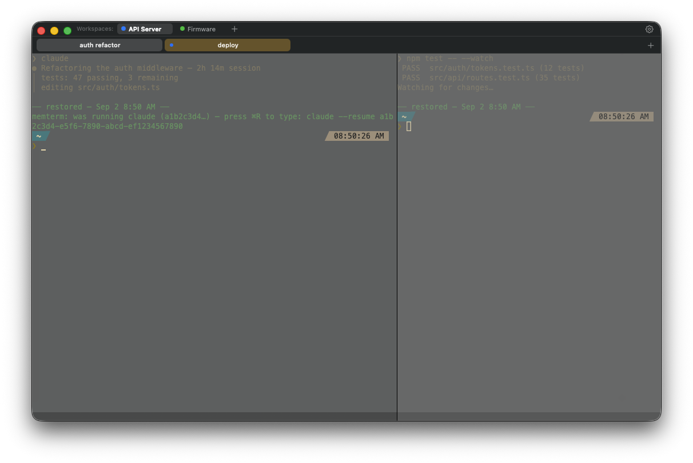

# memterm

**The terminal that remembers.**

memterm is a macOS terminal emulator whose defining feature is *session memory*: reboot your Mac mid-workday and everything comes back — every window, workspace, tab, split, working directory, and scrollback line — with your Claude Code conversations, SSH connections, and serial sessions one keystroke from resuming exactly where they were. Like Chrome's "Restore tabs?", but for your entire terminal life.



*A restored session: the workspace bar, a custom-tinted tab, split panes with dimmed ghost scrollback above the "restored" divider, and a consent-gated offer to resume the Claude Code session that was running before shutdown.*

## Why

Every terminal on macOS loses your work at reboot. iTerm2's session restoration keeps ptys alive in a daemon — until the machine restarts. memterm inverts the architecture: **the disk is the persistence layer**. A SQLite journal continuously records your workspace topology, per-pane working directories (kernel-truth, no shell integration required), scrollback, and *what was running* — then every launch runs the same restore pipeline, so the code path that saves you after a kernel panic is the one exercised every ordinary morning.

## What's here

**Memory**
- Full restore on every launch: windows, workspaces, tabs, splits, cwds, scrollback (as searchable "ghost" history above a restore divider)
- **Resumable sessions**: a pane that was running Claude Code offers `claude --resume <session>` — lossless, full conversation context. SSH panes offer exact-argv reconnection. Serial panes offer reconnection to the same device and settings.
- **Consent is absolute**: memterm never re-executes a captured command without an explicit gesture (⌘R types the command; *you* press Enter). A hard denylist (`sudo`, `rm`, `git push --force`, …) is never offered at all.
- **Memory follows intent**: closing a tab *forgets* it (rows and scrollback deleted from disk); quitting *keeps* everything; a crash *restores* everything. Forget commands exist at every granularity, up to "Forget Everything".
- Per-tab shell history: press ↑ in a restored tab and get *that tab's* commands first, then your global history. Your `~/.zsh_history` is never touched.

**Workspaces**
- Named, colored tab groups with an always-visible bar — click to switch, double-click to rename, hover ✕ to park (memory kept) or forget
- Switching is non-destructive: hide/show with a crossfade — a running `ping` survives; nothing moves; nothing re-executes
- Background activity: a workspace with unseen output shows a ring; a pulsing dot while output flows
- ⌃⌘1–9 switch workspaces, ⌘1–9 switch tabs

**Terminal**
- Custom tab chrome: whole-tab color tints, per-tab close, drag reorder, double-click rename
- Splits (⌘D / ⌘⇧D), per-pane ⌘F search across ghost + live scrollback, overlay scrollbar, selection that survives streaming output
- Nerd-font auto-detection, `.itermcolors` import, six built-in themes, transparency + blur, option-as-meta, bell styles, cursor styles
- New tabs inherit your current directory (kernel-truth — works without shell integration)

**Serial** (for embedded work)
- ⌘⇧K connect sheet: ports listed by USB product name, auto-baud detection with ranked confidence, flow control, 8N1 defaults
- Hex dump lens (⌘⇧X), Send Hex, DTR/RTS toggles, break, ESP32/Arduino-correct Reset Board
- Footer status bar: connection state, **live-changeable baud**, TX/RX counters, DTR/RTS chips
- Unplug → auto-reconnect on replug (keyed to USB serial number), scrollback intact

## Install / build

**Download:** the latest DMG is on the [Releases page](https://github.com/ril3y/memterm/releases). The app self-updates (Sparkle, iTerm2-style): it checks the release feed daily and offers new versions; **memterm ▸ Check for Updates…** checks now. Builds are ad-hoc signed — on first launch, right-click ▸ Open.

**From source:**

```sh
git clone https://github.com/ril3y/memterm.git && cd memterm
bash scripts/make-app.sh     # builds release, stamps version+sha, produces dist/memterm.app
open dist/memterm.app
```

Requires macOS 14+ and a Swift 6 toolchain. `dist/memterm.app/Contents/MacOS/memterm --version` prints the exact commit and build time of any binary.

**Releasing:** push a tag `vX.Y.Z`. The Release workflow builds the stamped app, wraps it in a DMG (`scripts/make-dmg.sh`), signs it with the Sparkle EdDSA key (`SPARKLE_PRIVATE_KEY` secret), writes the appcast (`scripts/make-appcast.sh`), and publishes both on the GitHub Release. Running apps pick it up from `releases/latest/download/appcast.xml`. CI runs the unit tests and the smoke save/verify restore gate on every push.

## Drop-down terminal (Quake style)

A global hotkey slides a terminal in from a screen edge and away again — the Quake console, the way Guake and iTerm2's hotkey window do it. Off until you enable it in **Settings ▸ Appearance**: pick the hotkey (click the recorder, press keys — e.g. ⌃`, ⌘⇧T, F12), the edge it slides from (top, left, right), alignment along the top edge, width × height as a percentage of the screen, which screen (the one under the mouse, or the main one), and whether it hides when another window takes focus. **Shell ▸ Toggle Drop-down Terminal** does the same as the hotkey. The panel belongs to the active workspace: its tabs are remembered and restored (hidden) like any others, it hides with its workspace on a switch, and every workspace gets its own on first use. The same keys live under `[dropdown]` in the config file.

## Configuration

One file: `~/.config/memterm/config.toml` (created with commented defaults on first launch), plus a native Settings window (⌘,) that reads and writes the same file. No preference-pane sprawl.

## Keyboard quick reference

| | |
|---|---|
| ⌘T / ⌘N | new tab / new window (inherits cwd) |
| ⌘D / ⌘⇧D | split right / down |
| ⌘⌥←→↑↓ | move pane focus |
| ⌘1–9 · ⌃⌘1–9 | tab N · workspace N |
| ⌘F / ⌘G | find in pane (ghost included) |
| ⌘R | type the pane's resume command (you press Enter) |
| ⌘⇧K | new serial connection |
| ⌘⇧X | hex lens (serial) |
| ⌘, | settings |

## Development

- `scripts/verify.sh` — the single verification entrypoint: unit tests, smoke restore protocol, UI probes (fresh + restored launch modes, pixel-level assertions), performance gates — all against the release artifact it stamps. See `TESTING.md`.
- `REQUIREMENTS.md` — the product requirements document this project is built against.
- Architecture: 100% Swift; SwiftTerm engine; AppKit chrome (custom tab strip, no native tabbing); SQLite WAL journal; no daemons.

## Status

Early development, moving fast. The memory engine, workspaces, custom chrome, serial support, and the testing harness described above are implemented and gate-verified; hardware serial has been validated against pty pairs, with real-device testing ongoing.
